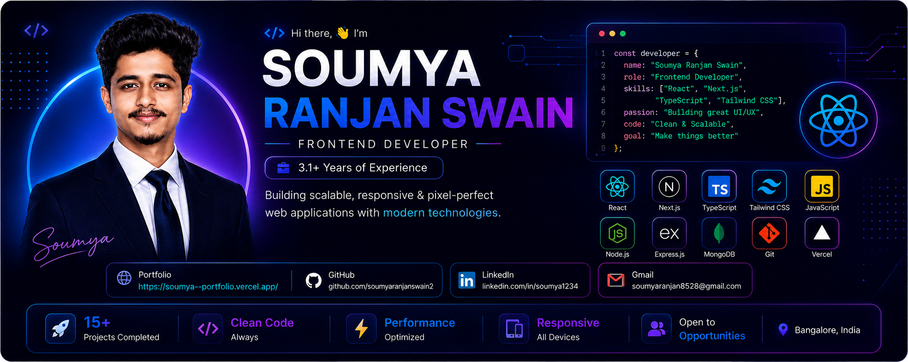

<div align="center">




<br/>

<a href="https://soumya--portfolio.vercel.app/" target="_blank">
  
</a>
<a href="https://linkedin.com/in/soumya1234" target="_blank">
  
</a>
<a href="https://github.com/soumyaranjanswain2" target="_blank">
  
</a>
<a href="mailto:soumyaranjan8428@gmail.com">
  
</a>

</div>

<br/>

## 👨‍💻 About Me

```javascript
const soumya = {
  role: "Frontend Developer",
  location: "Bengaluru, India",
  experience: "3.1+ years",
  currentCompany: "The Adecco Group",
  stack: ["React.js", "Next.js", "TypeScript", "Tailwind CSS", "Redux Toolkit"],
  focus: "Building scalable, performant, role-based web applications",
  currentlyLearning: "Three.js & advanced GSAP animation",
  funFact: "I optimize renders the way baristas optimize espresso shots ☕"
};
```

- 🔭 Currently building **enterprise-grade real estate platforms** with Next.js
- ⚡ Passionate about **performance engineering** — code splitting, memoization, Core Web Vitals
- 🎯 Focused on **role-based dashboards** & complex multi-persona application architecture
- 🤝 Comfortable working cross-functionally with design, backend, and product teams in Agile sprints
- 📈 Reduced feature dev time by **~30%** through reusable component libraries
- 💬 Ask me about **React performance optimization** or **Next.js SSR/SSG patterns**

<br/>

## 🛠️ Tech Stack

<div align="center">

**Frontend**


**State & Data**


**Backend Exposure**


**Tools & Workflow**


</div>

<br/>

## 🚀 Featured Projects

<table>
<tr>
<td width="50%">

### 🏠 PropertyOTP
**Real Estate Marketplace Platform**

Full-featured platform enabling customers, brokers & builders to list, manage, and discover properties at scale.

- 6-step guided listing workflow with persistent state
- Role-based dashboards for 3 distinct user personas
- Next.js SSR/SSG for SEO-friendly discoverability

`React.js` `Next.js` `Redux Toolkit` `Tailwind CSS`

</td>
<td width="50%">

### 🎬 Online Video Tutorial Library
**YouTube-style Content Platform**

JWT-secured video platform with admin uploads, categorization & role-differentiated access control.

- Full RBAC implementation
- 3-tier MVC architecture
- Redesigned UX to reduce viewer drop-off

`React.js` `Node.js` `Express.js` `MongoDB`

</td>
</tr>
<tr>
<td width="50%">

### 🛒 Online Shopping Application
**Production-grade E-Commerce Storefront**

Full shopping experience with dynamic catalog, persistent cart, and streamlined checkout.

- Advanced search & filtering
- Persistent cart with quantity management
- Fully responsive across all breakpoints

`React.js` `Bootstrap` `JavaScript`

</td>
<td width="50%">

### 💼 Portfolio Website
**Personal Developer Portfolio**

A showcase of projects, skills, and experience built with modern frontend tooling.

🔗 [soumya--portfolio.vercel.app](https://soumya--portfolio.vercel.app/)

`React.js` `Next.js` `Tailwind CSS`

</td>
</tr>
</table>

<br/>

## 📊 GitHub Analytics

<div align="center">


<br/>


<br/>


</div>

<br/>

## 📈 Impact Highlights

| Metric | Result |
|---|---|
| 🧩 Reusable UI Components Shipped | **20+** components, ~30% faster feature development |
| ⚡ Page Load Performance | **25%+** improvement via memoization & lazy loading |
| 🔌 REST API Integrations | **25+** endpoints across production applications |
| 🐛 Production Reliability | Zero critical bugs on owned features across multiple release cycles |

<br/>

## 📫 Let's Connect

<div align="center">

I'm open to **Frontend Developer** opportunities — let's build something great together.

<a href="mailto:soumyaranjan8428@gmail.com">
  
</a>
<a href="https://linkedin.com/in/soumya1234">
  
</a>
<a href="https://soumya--portfolio.vercel.app/">
  
</a>

<br/><br/>


</div>


